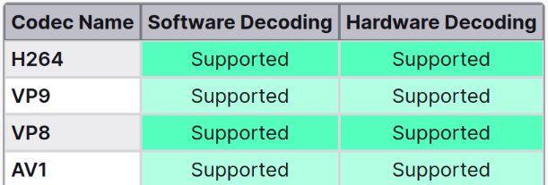
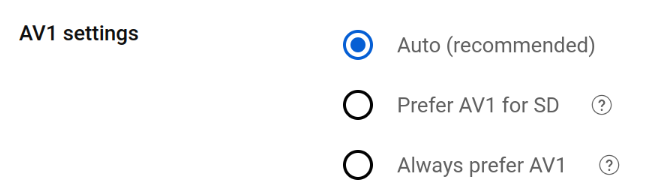
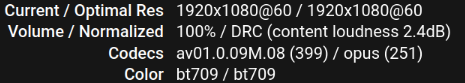

# youtube-accel (YouTube Acceleration)

No more buffering or pixelated videos when watching YouTube!

As of 2025, YouTube has become the de-facto library of human knowledge. Its operating company, Google, has YouTube servers all around the globe, while [peering with every major ISP](https://peering.google.com/). Therefore, in theory, you should be able to watch YouTube videos smoothly without any buffering.

However, there are still some people who have decent internet, but YouTube buffers all the time. It's time to find out why.

## YouTube Video Servers (gvs)

While watching YouTube videos, YouTube grabs your IP address, maps it to your current location, routes your request to the fastest server near you, and sends you the video data.

There are a few known endpoints YouTube uses to map your IP address to the closest server:

- [https://redirector.googlevideo.com/](https://redirector.googlevideo.com/report_mapping?di=no) (Most common, used on YouTube Mobile/Tablet/TV App)
- [https://redirector.gvt1.com/](https://redirector.gvt1.com/report_mapping?di=no) (I haven't seen that yet)
- [http://redirector.c.youtube.com/](http://redirector.c.youtube.com/report_mapping?di=no) (I haven't seen that yet, also no HTTPS support)
- https://www.youtube.com/ (If you are using a desktop browser)
- https://m.youtube.com/ (If you are using a mobile browser)

If you manually [open the debug page](https://redirector.googlevideo.com/report_mapping?di=no "YouTube Report Mapping"), There are 2 possibilities:

1. Your ISP has YouTube caching servers:

```
xxx.xxx.xxx.xxx => xxxxxx-xxxx          (xxx.xxx.xxx.xxx/xx)
^^^^^^^^^^^^^^^    ^^^^^^^^^^^          ^^^^^^^^^^^^^^^^^^^^
Your IP address    YouTube-Server ID    Your IP's CIDR range
```

2. Your ISP does not have a YouTube caching server, so Google's servers are used:

```
xxx.xxx.xxx.xxx => xxxxxxxx : router:   "xxxx.xxxxx" next_hop_address: "xxx.xxx.xxx.xxx" (xxx.xxx.xxx.xxx/xx)
^^^^^^^^^^^^^^^    ^^^^^^^^              ^^^^^^^^^^                                       ^^^^^^^^^^^^^^^^^^
Your IP address    YouTube-Server ID     Google's Internal Server ID                      Your IP's CIDR range
```

And then, your browser/app will get the video from somewhere looking like this:

```
rx---sn-xxxxxx-xxxx.googlevideo.com
rrx---sn-xxxxxx-xxxx.googlevideo.com
rrx---sn-xxxxxx-xxxx.c.youtube.com
```

To find the exact hostname, use "Inspect Element" (Or press F12), go to the `Network` tab, and refresh the page when watching a video.

You can try `nslookup` the address in Command Pronpt/Terminal like this:

```
nslookup rrx---sn-xxxxxx-xxxx.googlevideo.com
```

If you encounter the error `nslookup: 'rx---sn-xxxxxx-xxxx.googlevideo.com' is not a legal IDNA2008 name` while using Linux, please execute `export IDN_DISABLE=1` and try again.

`nslookup` will fetch both the IPv4 and v6 addresses for you, which is nice.

And then `ping` the IP address you just got. Make sure there's no packet loss and latency less than 50ms.

You can also `tracert` (Windows) or `traceroute` (MacOS/Linux) the IP addresses. [Here's how](traceroute.md).

The steps above will locate the issue of why your YouTube buffers. Depending on the result, you either complain to/switch your ISP or re-configure your network.

## How to convert YouTube hostname `rrx---sn-xxxxxx-xxxx.googlevideo.com` to real server ID

The conversion rules are as follows, encoded text is on the left and plaintext is on the right.

|       |   |       |   |       |   |       |   |       |   |       |   |
|-------|---|-------|---|-------|---|-------|---|-------|---|-------|---|
| **0** | u | **7** | 0 | **e** | 1 | **l** | 2 | **s** | 3 | **z** | 4 |
| **1** | z | **8** | v | **f** | w | **m** | x | **t** | y |       |   |
| **2** | p | **9** | q | **g** | r | **n** | s | **u** | t |       |   |
| **3** | k | **a** | l | **h** | m | **o** | n | **v** | o |       |   |
| **4** | f | **b** | g | **i** | h | **p** | i | **w** | j |       |   |
| **5** | a | **c** | b | **j** | c | **q** | d | **x** | e |       |   |
| **6** | 5 | **d** | 6 | **k** | 7 | **r** | 8 | **y** | 9 |       |   |

Note that `u` and `z` appear to be reversed.

For example, `r1---sn-cxaaj5o5q5-tt1ed.googlevideo.com` is actually `r1.bellcanada-yyz16`.
`rr1.sn-q0cedn7s.googlevideo.com` is actually `r1.dub16s03`(Google's server in Dublin).

## Disable AV1 Format (if you really want to)

**Update: Firefox may have solved the issue. So probably leave AV1 enabled for now.**

**Also, disabling AV1 may impact your ability to play 1080p premium videos.**

AV1, or AOMedia Video 1, is an open, royalty-free video coding format designed for video transmissions over the internet. It offers significant improvements in compression efficiency compared to older codecs. This means that it can deliver higher quality video at lower bitrates, making it ideal for streaming video over the internet.

Sounds cool, right?

However, there is a catch, **(at least for now)**.

It uses a more complex compression algorithm, so unless your computer's CPU/GPU is very recent (supports hardware AV1 decoding), you will not have a good time.

Your CPU can have 70%+ utilization (even with some hardware acceleration) for 4K60fps vidoes compared to VP9 (10%-20% @ 4K60).

I have a 12th Gen Intel CPU, so in theory it should support hardware AV1 decoding. Even Firefox is claiming so!



## How to disable AV1

### If you have Firefox

Go to `about:config`, click through the warning, search for `media.av1.enabled` and set it to `false`.

Also, if you have Firefox syncing, add `services.sync.prefs.sync.media.av1.enabled` as a boolean and set it to `true`, so the change will be synced across all your devices (if you want)!

### ~~If you have Chrome and signed into a Google account~~ (Google removed this setting)

~~Go to [https://www.youtube.com/account_playback](https://www.youtube.com/account_playback). You'll see a setting like this:~~



~~Select **Prefer AV1 for SD**. Althrough it doesn't disable AV1 completely, 480p or lower AV1 videos are not resource hungry.~~

### Checking for results

Did you truly disabled AV1 (or limited to SD only)? You can check the results.

Go to a popular video (1080p or higher) like [this one](https://www.youtube.com/watch?v=dQw4w9WgXcQ), right click, select **Stats for nerds**. It will say something like this:



As long it doesn't say `av01`, you're good to go. It could be `vp09` or `avc1`.

**Do not confuse `avc1` with `av01`!** `AVC` is just an alias for `H.264`.

Check more videos to be sure AV1 is not used. YouTube tends to re-encode popular videos with AV1.
